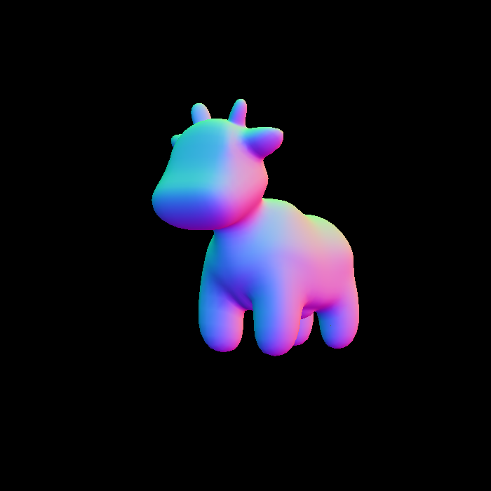
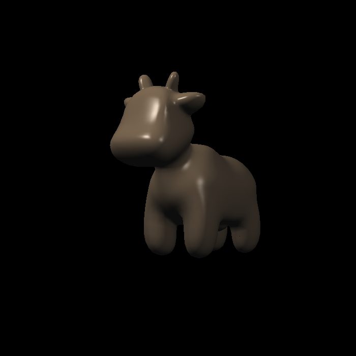
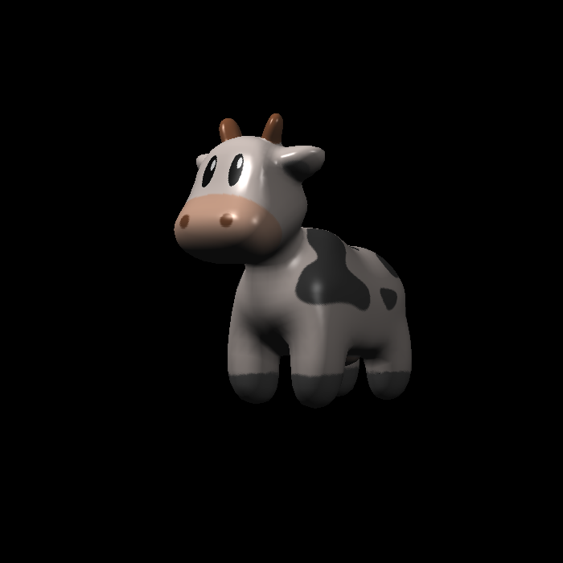
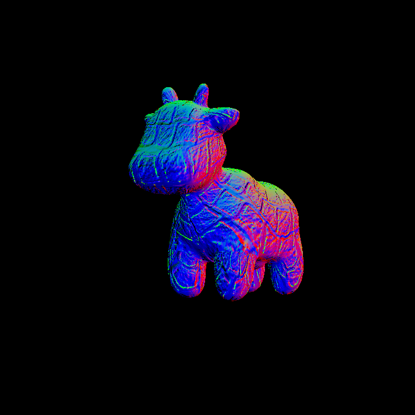
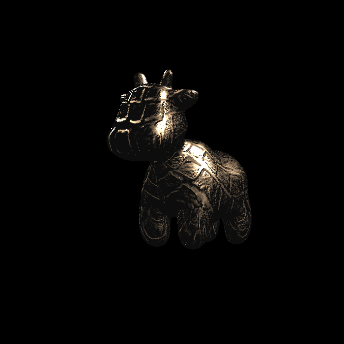
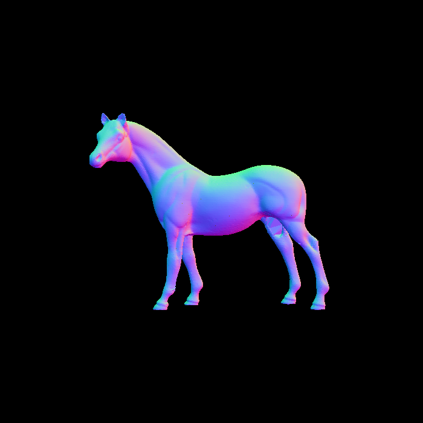

### 完成项说明
1. 使用Barycentric Coordinatess 对法向量、颜色、纹理颜色与底纹颜色进行了插值.  

2. 根据ppt中公式实现 Blinn-Phong 反射模型  

3. 获取纹理u,v所在颜色(+Bling-Phong)  

4. 按照代码提示实现 Bump Mapping  
  
5. 按照代码提示实现 Displacement Mapping   
  
6. 尝试了带有 `vn` 的 horse 模型   
  
除文件名外, 需要同时修改`angle`为90, `get_model_matri`函数中`scale`为25

