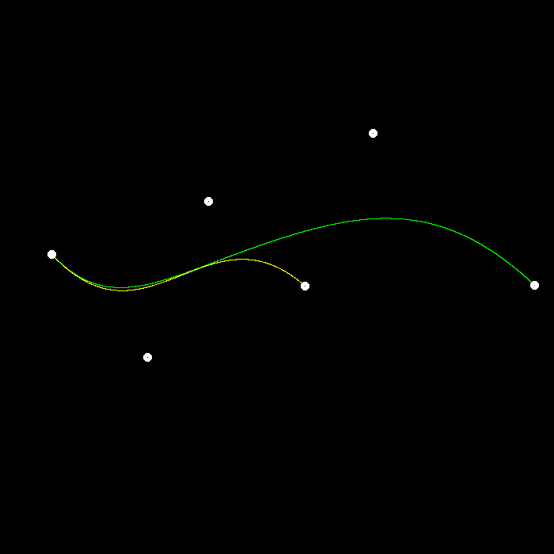

### 完成项
- 递归实现 de Casteljau 算法
- 支持更多点 命令 `./BezierCurve N` , 其中 `N` 为控制点数量

### 测试记录
#### test1
Left button of the mouse is clicked - position (364, 115)  
Left button of the mouse is clicked - position (152, 265)  
Left button of the mouse is clicked - position (503, 446)  
Left button of the mouse is clicked - position (331, 591)  

#### test2
Left button of the mouse is clicked - position (96, 343)  
Left button of the mouse is clicked - position (625, 355)  
Left button of the mouse is clicked - position (300, 459)  
Left button of the mouse is clicked - position (550, 221)  

#### test3
Left button of the mouse is clicked - position (42, 322)  
Left button of the mouse is clicked - position (123, 410)  
Left button of the mouse is clicked - position (234, 297)  
Left button of the mouse is clicked - position (312, 366)  
Left button of the mouse is clicked - position (439, 230)  
Left button of the mouse is clicked - position (639, 331)  

#### test4
Left button of the mouse is clicked - position (85, 370)  
Left button of the mouse is clicked - position (171, 151)  
Left button of the mouse is clicked - position (392, 102)  
Left button of the mouse is clicked - position (559, 199)  
Left button of the mouse is clicked - position (557, 350)  
Left button of the mouse is clicked - position (459, 482)  
Left button of the mouse is clicked - position (302, 467)  

