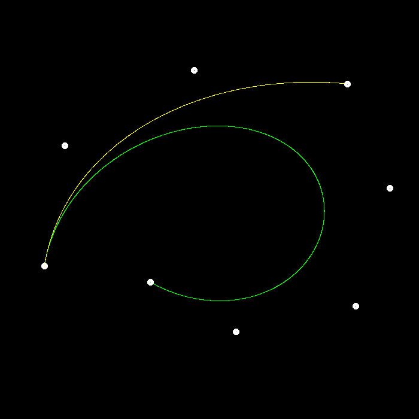

### 完成项
- 递归实现 de Casteljau 算法
- 支持更多点 命令 `./BezierCurve N` , 其中 `N` 为控制点数量

### 测试记录
#### test1
Left button of the mouse is clicked - position (331, 579)  
Left button of the mouse is clicked - position (485, 424)  
Left button of the mouse is clicked - position (211, 234)  
Left button of the mouse is clicked - position (406, 53)   

#### test2
Left button of the mouse is clicked - position (141, 352)  
Left button of the mouse is clicked - position (428, 406)  
Left button of the mouse is clicked - position (323, 440)  
Left button of the mouse is clicked - position (530, 195)  

#### test3
Left button of the mouse is clicked - position (65, 321)  
Left button of the mouse is clicked - position (186, 451)  
Left button of the mouse is clicked - position (263, 254)  
Left button of the mouse is clicked - position (385, 361)  
Left button of the mouse is clicked - position (471, 168)  
Left button of the mouse is clicked - position (675, 360)  

#### test4
Left button of the mouse is clicked - position (74, 444)  
Left button of the mouse is clicked - position (108, 243)   
Left button of the mouse is clicked - position (324, 117)  
Left button of the mouse is clicked - position (580, 140)  
Left button of the mouse is clicked - position (651, 314)  
Left button of the mouse is clicked - position (594, 511)  
Left button of the mouse is clicked - position (394, 554)  
Left button of the mouse is clicked - position (251, 471)  

