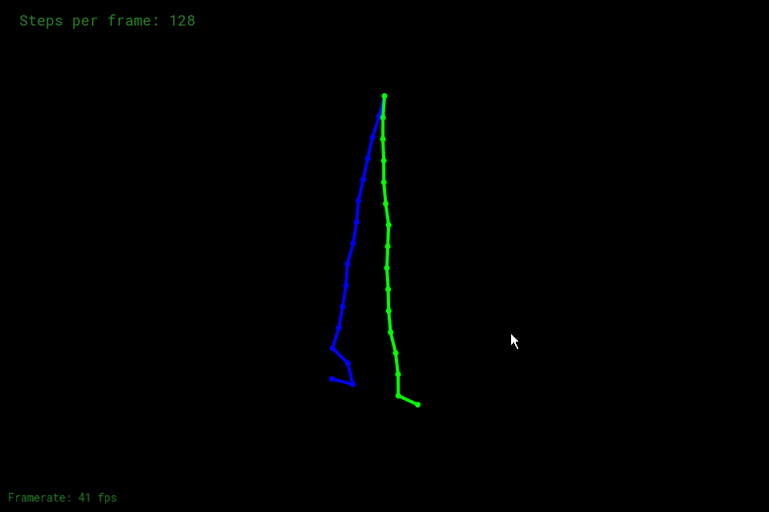

I finished tasks:
- rope construction
- semi-implicit Eular with damping
- explicit Eular (in comment)
- explicit Verlet with damping

### Results
#### Eular
- without damping

- semi-implicit Eular with damping

- explicit Eular with damping

#### Verlet
- 64 steps

- 128 steps

