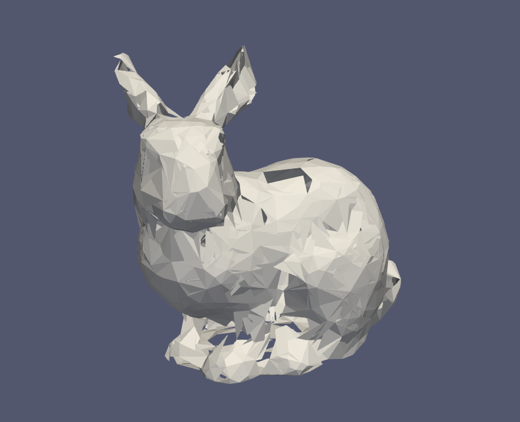

作者:莫怡晨  
邮箱:amomorning@gmail.com  
选做**2.4.3 用点云来构建网格**  
仅使用Eigen, 在Paraview中可视化
### 完成项
- 预处理网格模型得到顶点坐标与顶点法向量(使用角度加权)
- 将点用桶排序放入体素中, 分块检索
- ball-pivoting算法
    - 三角形求外接圆
    - 找到法线方向的外接球
    - 小球滚动轨迹线上最近的球心及对应的网格面
    - 加边(join)/删边(glue)操作
### 过程
整个算法的核心是找到是用一个合适半径的小球, 这个小球从一个三角面出发, 找邻近的点将三角形加入面片集中.

但由于输入数据本身疏密导致在小球半径的选择上出现困难.

没有实现glue操作的时候可以得到有点赛博朋克的碎片兔子

设置不同的小球半径和随机种子(随机种子用于得到开始滚小球的面)
使用bunny.obj
点数2503
原始面片数4968

#### 半径0.005
面片数 2330

#### 半径0.0075
面片数 2990

#### 半径0.01
面片数 4690

### 问题与不足
- 对于不均匀的点云密度难以调整合适的小球半径生成网格模型
- 数据结构设计上存在问题, join和glue操作时无法索引边的顺序, 难以按照论文调整拓扑
